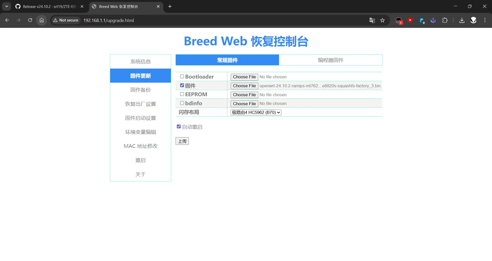

# ZTE E8820S Openwrt
Custom firmware for ZTE E8220S based on official openwrt source

## Default login
```
URL = 192.168.11.1
user = root
no password, just hit enter

Wi-Fi ssid = OpenWrt
Password = 12345678
```

## Installation
This firmware required [BREED](https://breed.hackpascal.net/) to booting, otherwise you could try the official [ImmortalWRT Build](https://firmware-selector.immortalwrt.org/)

1. Reboot to BREED web recovery by turning on the router and press & hold reset button for 5 seconds
2. Select openwrt-*-ramips-mt7621-zte_e8820s-squashfs-factory.bin firmware & HC5962 layout


### Based on
- [Official Openwrt Firmware](https://github.com/openwrt/openwrt)
- Github Action [P3TERX Actions-Openwrt](https://github.com/P3TERX/Actions-OpenWrt/)
- Patch File [TwoOnefour](https://github.com/TwoOnefour/E8820S-OpenWrt)

[](https://github.com/srt19/ZTE-E8820S/actions/workflows/openwrt-builder.yml)