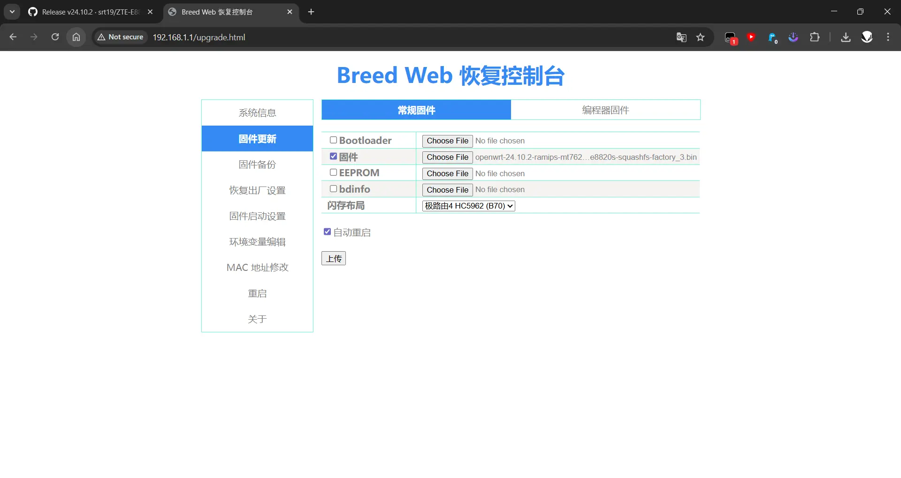

# ZTE E8820S OpenWrt
Custom firmware for ZTE E8220S based on official [OpenWrt](https://github.com/openwrt/openwrt)

## Default login
```
URL = 192.168.1.1
user = root
no password, just hit enter

Wi-Fi ssid = OpenWrt
Password = 12345678
```

## Compiling
1. Before compiling make sure to install building dependencies [Build System Setup](https://openwrt.org/docs/guide-developer/toolchain/install-buildsystem)

2. Follow this instruction until step number 5 updating the feeds [Openwrt Build System Usage](https://openwrt.org/docs/guide-developer/toolchain/use-buildsystem)

3. Applying patch
```bash
# DTS File
cp patch/mt7621_zte_e8820s.dts openwrt/target/linux/ramips/dts

# LED
sed -i -e '/^esac/i \\' -e '/^esac/r patch/leds.txt' openwrt/target/linux/ramips/mt7621/base-files/etc/board.d/01_leds

# Make configuration
cat patch/zte.txt >> openwrt/target/linux/ramips/image/mt7621.mk

# Default setting for wifi ssid & password
cp patch/99-default-settings openwrt/package/base-files/files/etc/uci-defaults
```

4. Download config.buildinfo file from OpenWrt Downloads and save as .config on openwrt folder.
Then run make menuconfig and select the subtarget as ZTE E8820S.
```bash
# e.g
wget -O openwrt/.config https://downloads.openwrt.org/releases/24.10.5/targets/ramips/mt7621/config.buildinfo

make menuconfig
```

5. Build the firmware image.
```bash
make defconfig download clean world
```

## Installation
This firmware required [BREED](https://breed.hackpascal.net/) to boot.
If your device using U-Boot mod use the official [ImmortalWRT Build](https://firmware-selector.immortalwrt.org/)

1. Reboot to BREED web recovery by turning on the router and press & hold reset button for 5 seconds
2. Connect to router via lan 1 port & go to http://192.168.1.1
3. Select openwrt-*-ramips-mt7621-zte_e8820s-squashfs-factory.bin firmware & HC5962 layout


### Based on
- [Official Openwrt Firmware](https://github.com/openwrt/openwrt)
- Github Action [P3TERX Actions-Openwrt](https://github.com/P3TERX/Actions-OpenWrt/)
- Patch File [TwoOnefour](https://github.com/TwoOnefour/E8820S-OpenWrt) [ImmortalWRT](https://github.com/immortalwrt/immortalwrt)